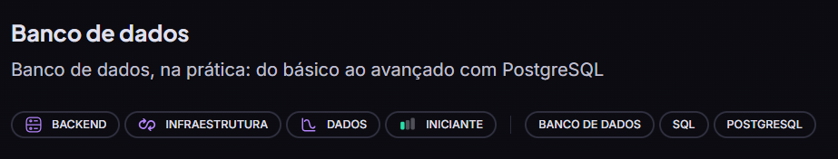
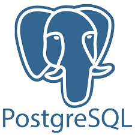

# Curso Banco de Dados - RocketSeat

**Professor Felipe Nunes**

Do Básico ao Avançado com PostreSQL
 

 

## Módulo 1 - Fundamentos

- Introdução ao Mundo dos Bancos de Dados
- Manipulação Básica de Dados
- Modelagem de Dados Essencial

## Módulo 2 - Consultas e Modelagem

- Consultas Avançadas
- Relacionamento e Junções

## Módulo 3 - Técnicas Avançadas

- Consultas Avançadas e Subconsultas
- Otimização e Performance
- Recursos Avançados do Postgres