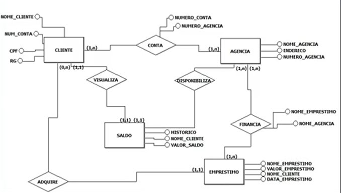
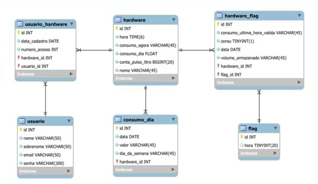
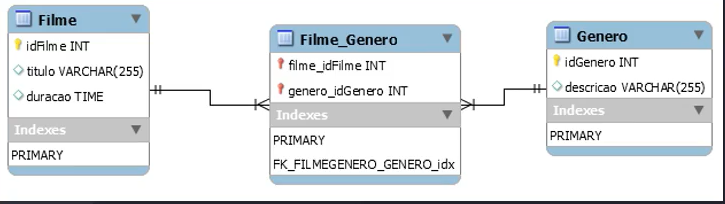
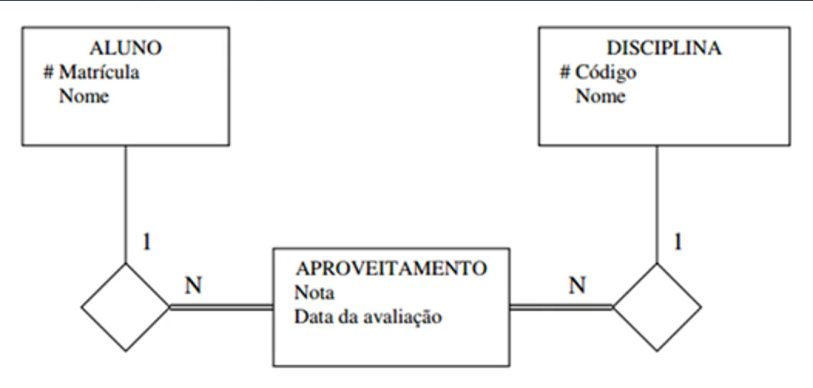

# Modelagem de Dados Essencial

**Conceitos de modelagem entidade-relacionamento**

## Introdução à Modelagem de Dados

- comprender o que é modelagem de dados;
- entender sua importãncia no desenvolvimento de sistemas;
- diferenciar os níveis de modelagem (conceitual, lógica e física)
- introduzir o modelo Entidade-Relacionamento => ER

**Modelagem**

- processo de representar estruturas de dados de um sistema
- criação de representações visuais (diagramas) para mapear entidades e relacionamentos
  -- entender o negócio, o problema, entender o que é necessário criar
  -- quais os dados que preciso ter? o que eu preciso armazenar? o que eu preciso consultar?
  -- local para guardar informações do usuário, guardar um registro, etc..
- serve como ponte entre os requisitos do negócio e o banco de dados
- fundamenta o projeto e a implementação de sistemas de informação
  -- no primeiro momento, apenas um _brainstorming_ de informações brutas, de acordo com o que estiver pensando
  -- depois faz o refinamento, alinhando às regras de negócios

_Importância da Modelagem_

- a criação da tabela no meu banco de dados é a última coisa a ser feita!
  -- o processo até chegar no nome da tabela e as colunas que são necessárias é o processo de modelagem
  -- quais as relações, quantas tabelas, conjunto de tabelas, garantir processamento
- organiza a complexidade dos dados
- facilita a comunicação entre equipe técnica e _stakeholders_
- permite melhor manutenção e evolução do sistema
- garante que os dados refiltam regras de negócio reais

_Banco mal modelado_

- dificuldade de manutenção
- dados duplicados ou contraditórios
- relatórios incorretos
- baixo desempenho na consulta
- dificuldade em escalar o sistema

- geralmente a solução é refazer parte do banco, gera retrabalho
- despender um tempo para criar uma boa modelagem para evitar retrabalho no futuro

### Níveis de Modelagem de Dados

**Modelo Conceitual**

- foco no negócio, sem detalhes técnicos
- utilização de diagramas ER
  exemplo:
  

**Modelo Lógico**

- traduz o modelo conceitual em estruturas compatíveis com SGBDs
- define os tipos de dados, chaves primárias e estrangeiras (relacionamentos)
  exemplo:
  

**Modelo Físico**

- detalha como os dados serão armazenados no SGBD específico
- inclui índices, tabelas físicas, partições, etc..
  exemplo:
  

### Modelo Entidade-Relacionamento

- criado por Peter Chen (1976)
- representa entidades, atributos e relacionamentos
- base para o modelo relacional de banco de dados
  -- softwares apoiam essa construção
- ferramenta visual para modelagem conceitual
  exemplo visual:
  
