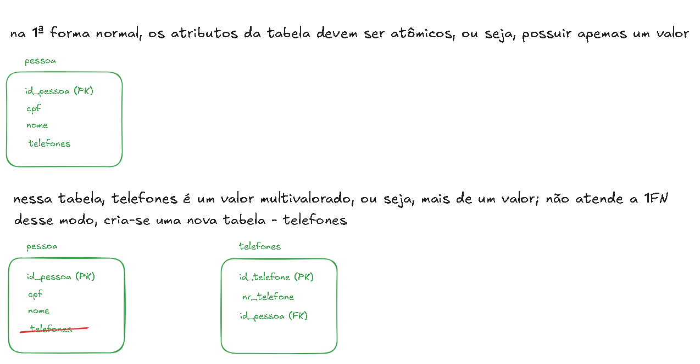
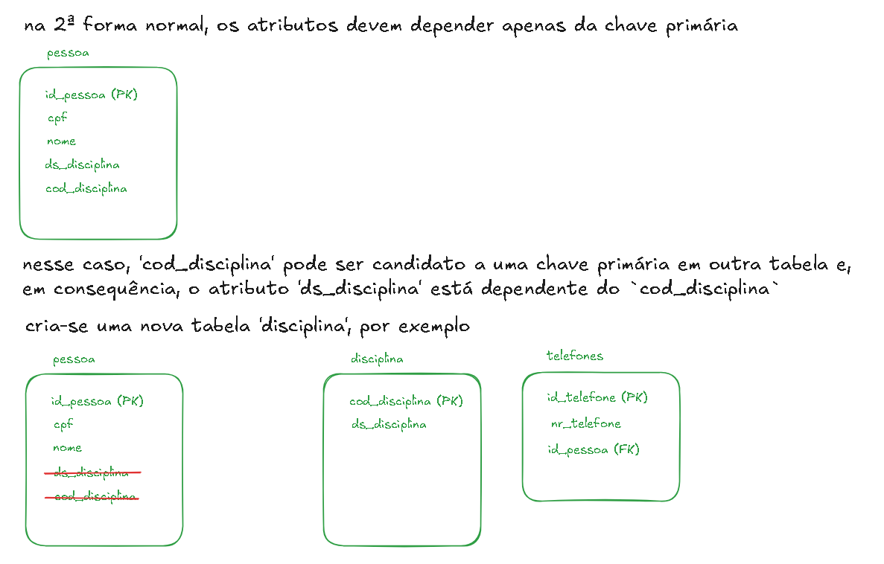

# Modelagem de Dados Essencial

**Conceitos de modelagem entidade-relacionamento**

## Introdução à Modelagem de Dados

- comprender o que é modelagem de dados;
- entender sua importãncia no desenvolvimento de sistemas;
- diferenciar os níveis de modelagem (conceitual, lógica e física)
- introduzir o modelo Entidade-Relacionamento => ER

**Modelagem**

- processo de representar estruturas de dados de um sistema
- criação de representações visuais (diagramas) para mapear entidades e relacionamentos
  -- entender o negócio, o problema, entender o que é necessário criar
  -- quais os dados que preciso ter? o que eu preciso armazenar? o que eu preciso consultar?
  -- local para guardar informações do usuário, guardar um registro, etc..
- serve como ponte entre os requisitos do negócio e o banco de dados
- fundamenta o projeto e a implementação de sistemas de informação
  -- no primeiro momento, apenas um _brainstorming_ de informações brutas, de acordo com o que estiver pensando
  -- depois faz o refinamento, alinhando às regras de negócios

_Importância da Modelagem_

- a criação da tabela no meu banco de dados é a última coisa a ser feita!
  -- o processo até chegar no nome da tabela e as colunas que são necessárias é o processo de modelagem
  -- quais as relações, quantas tabelas, conjunto de tabelas, garantir processamento
- organiza a complexidade dos dados
- facilita a comunicação entre equipe técnica e _stakeholders_
- permite melhor manutenção e evolução do sistema
- garante que os dados refiltam regras de negócio reais

_Banco mal modelado_

- dificuldade de manutenção
- dados duplicados ou contraditórios
- relatórios incorretos
- baixo desempenho na consulta
- dificuldade em escalar o sistema

- geralmente a solução é refazer parte do banco, gera retrabalho
- despender um tempo para criar uma boa modelagem para evitar retrabalho no futuro

### Níveis de Modelagem de Dados

**Modelo Conceitual**

- foco no negócio, sem detalhes técnicos
- utilização de diagramas ER
- exemplo:
   
  
   

**Modelo Lógico**

- traduz o modelo conceitual em estruturas compatíveis com SGBDs
- define os tipos de dados, chaves primárias e estrangeiras (relacionamentos)
- exemplo:
   
  
   

**Modelo Físico**

- detalha como os dados serão armazenados no SGBD específico
- inclui índices, tabelas físicas, partições, etc..
- exemplo:
   
  
   

### Modelo Entidade-Relacionamento

- criado por Peter Chen (1976)
- representa entidades, atributos e relacionamentos
- base para o modelo relacional de banco de dados
  -- softwares apoiam essa construção
- ferramenta visual para modelagem conceitual
- exemplo visual:
   
  
   

## Componentes do modelo Entidade-Relacionamento

### Entidade

- representa um objeto do mundo real sobre o qual queremos armazenar dados
  -- exemplo: aluno, curso, produto, funcionário ...
  -- construção de pequenos "pedaços" para posterior contrução do todo
- no diagrama ER, a entidade é representada por um retângulo
- abstração: não vou guardar todos os dados possíveis de uma entidade, mas sim os dados necessários
  -- exemplo: entidade `Pessoa`
  -- preciso de nome, cpf, telefone, email
  -- observe que 'Pessoa' pode ter muito mais informações olhando para o 'mundo real', mas para a aplicação não é necessário
- info: na criação das entidades, observar sempre se algum atributo da minha entidade não poderia viar outra entidade
  -- exemplo: entidade `Pessoa` pode ter um ou mais endereços vinculados a ela
  -- em vez de criar o atributo endereço 'dentro' da entidade pessoas, talvez seja interessante criar uma entidade `Endereco` para que as informações fiquem, de certa forma, 'separadas'

**Tipos de Entidades**

- Entidade Forte
  -- possui um atributo identificador próprio (chave primária)
  -- **ID** => valor que não se repete
  -- exemplo: Aluno, Curso, Pessoa
- Entidade Fraca:
  -- depende de outra entidade para existir
  -- não possui chave própria
  -- representada no diagrama por um 'retângulo duplo'
  -- exemplo: dependente (de um funcionário)

### Atributos

- Propriedades ou cartacterísticas da entidade
  -- representados por elipses ligadas às entidades
- Tipos de Atributos
  -- Simples (Atômico): não pode ser subdividido
  -- Composto: pode ser dividido (endereço, por exemplo, como atributo de uma entidade, possui rua, cep, bairro, cidade, estado, ...)
  -- Derivado: pode ser calculado a partir de um outro valor (exemplo: calcular a idade, a partir da data de nascimento)
  --- outro exemplo: nota fiscal (impostos derivados, total, bc, etc)
  -- Multivalorado: pode conter mais de um valor (telefone: comercial, celular, whatsapp, residencial, ... )

### Relacionamentos

- representado por um 'losango'
- exemplo: PESSOA => 'possui' => ENDEREÇO
- Grau: quantidade de entidades envolvidas
  -- Binário = mais comum, relacionamento com 2 entidades
  -- Ternário = três entidades vinculadas a um relacionamento
  -- N-ário = mais de 3 entidas associadas ao mesmo relacionamento
- representação muda conforme o grau
  -- grau 2: FUNCIONÁRIO => 'trabalha' => DEPARTAMENTO
  -- grau 3: Médico atende o Paciente com uso de equipamento
  --- MÉDICO => 'atende' => PACIENTE
  --- MÉDICO => 'usa' => EQUIPAMENTOS
  --- não pode ser modelado com 3 relacionamentos binários
  --- deve ser representado como um único losango

- relacionamento recursivo
  -- entidade se relaciona com ela mesma
  -- exemplo: FUNCIONÁRIO => 'gerencia' => FUNCIONÁRIO
  -- no caso, 'gerente' e 'subordinado'
  -- representado um uma 'seta' que vai e volta para a própria entidade

- relacionamentos com informações próprias
  -- exemplo: aluno => matrícula => curso
  -- matrícula seria o 'relacionamento'
  -- e esse relacionamento possui atributos específicos
  -- atributos que não 'cabem' às entidades ligadas
  -- representado por elipses ligadas ao relacionamento

- **Cardinalidade de Relacionamentos**
  -- define quantos registros de uma entidade se associam à outra
  -- que define? a regra de negócio
  -- 1:1 => uma para um
  --- exemplo: uma pessoa pode ter apenas um único endereço
  -- 1:N => um para muitos
  --- exemplo: uma pessoa pode ter um ou mais endereços associados
  -- N:N => muitos para muitos
  --- exemplo: um curso tem muitos alunos e um aluno possui muitos cursos
  --- nesse cenário N:N, em vez de criar um relacionamento, cria-se uma nova entidade: 'CURSOS_ALUNOS', para armazenamento

## Chaves Primárias

- um atributo (ou conjunto de atributos) que identifica unicamente cada tupla (linha) em uma tabela
- não pode ser null
- deve ser único em todos os registros
- exemplo: CPF, matrícula, id_cliente, ...
  -- no postgre, usar dado 'SERIAL', por exemplo
  -- UUID, também utilizado para identificadores únicos

- garante a integridade dos dados
- buscas eficientes e atualizações seguras
- base para **relacionamentos entre tabelas** (referência em chaves estrangeiras)
- é usada para indexação em SGBDs

- boa chave primária:
  -- unicidade: ser única
  -- imutabilidade: não mudar com o tempo
  -- não nula: não pode ser nula
  -- estabilidade: valor confiável
  -- simplicidade: curto e fácil de indexar
  -- naturalidade ou substituição consciente

- definir a chave primária nas entidades
  -- no modelo conceitual não entra tanto, mas nos modelos físicos e lógicos sempre!

### Chave Natural e Chave Substituta (conceito)

- chave natural
  -- já existe nos dados reais
  --- exemplo: cpf, matrícula, ..
  -- vantagem: significativa, fácil de entender
  -- desvantagens: pode mudar ao longo do tempo

- chave substituta
  -- criada artificialmente pelo sistema (id, uuid)
  -- vantagem: estabilidade, simplicidade, controle
  -- desvantagem: não tem significado para o usuário

- quando usar?
  -- chave natural: se for estável, curta e garantir unicidade
  -- chave substituta: quando os dados naturais forem longos, instáveis ou sensíveis
  --- boa prática em sistemas complexos e integrados

## Chaves Estrangeiras

**Um campo (ou conjunto de campos) que faz referência à chave primária de outra tabela**

- estabelece relacionamento entre as tabelas
- garante a consistência dos dados

Papel na integridade referencial:

- não existam registros órfãos
- banco de dados impede exclusões ou inclusões indevidas

- a chave estrangeira em uma entidade deve existir como chave primária na tabela de referência
- o banco de dados não permite salvar, por exemplo, um novo registro se a chave estrangeira não existir na tabela de referência

_Restrições_

- ON DELETE e ON UPDATE
  -- comportamentos automáticos para serem implementados

ON DELETE

- deletar um registro em uma tabela que é uma chave estrangeira em outra
  -- exemplo: tabela uf e tabela cidades; a uf é uma FK na tabela cidades e eu tento excluir diretamente a uf do banco de dados, mas ela tem relacionamento com outras entidades
  -- inserir regras via SQL
- `RESTRICT`: impede a exclusão de houver dependência
- `CASCADE`: apaga também os registros filhos - efeito cascata _atenção para utilizar_
- `SET NULL`: define como `null` o valor da FK
- `NO ACTION`: comportamento padrão (erro se houver dependência)

## Normalização

- Modelo Conceitual
  -- o que o sistema precisa guardar, em termos de entidades, atributos e relacionamentos
  -- geralmente representado por diagrama ER
  -- serve para alinhar requisitos com _stakeholders_
  -- Diagrama ER puro, sem pensar em tabelas, tipos de dados ou SGBD

- Modelo Lógico (Relacional)
  -- transformação do modelo conceitual para lógico
  -- como organizar as informações em relações (tabelas), definindo: tabelas e colunas, chaves primárias e estrangeiras, dependências funcionais e formas normais
  -- nessa etapa já faz a normalização (1FN, 2FN, 3Fn ...) e obtém o _Esquema Relacional_

- Modelo Físico
  -- detalhamento de implementação no SGBD escolhido
  --- tipos de dados específicos (VARCHAR, INT, DATA, ...)
  --- índices, particões, tablespaces
  --- restrições avançadas (checks, triggers) e parâmetros de performance
  -- geração do DDL (CREATE TABLE, CREATE INDEX ... )
  --- Data Definition Language

**Processo de conversão do Modelo Conceitual para o Modelo Lógico**

Modelo lógico = modelo para criação do modelo físico do banco de dados

## Como funciona a normalização

**Modelagem Relacional**

_Regras de Integridade - Integridade de Identidade_

- a chave primária não pode conter valores nulos
- a chave primária deve ser obrigatoriamente preenchida
- a chave primária não deve ter valores repetidos em uma tabela, valor único

_Regras de Integridade - Integridade Referencial_

- se a tabela A possui uma chave estrangeira que estabelece relacionamento com uma tabela B, então o valor da chave estrangeira na tabela A deve ser igual ao valor da chave primária na tabela B
  - esta regra garante que as referências de uma tabela para outra tabela sejam válidas

_Regras de Integridade - Integridade de Domínio_

- restringe o conjunto de valores que podem ser gravados em uma coluna de domínio (apenas valores que pertencem ao domínio podem ser gravados na tabela)
  - o SGBD desfaz a atualização pois não são permitidos
  - exemplo: `idade CHAR(2)` - no caso esse domínio seria o `CHAR(2)` que limita as informações a serem gravadas

## Regras de Transformação Relacional

### Entidades e Atributos

_Mapeamento das Entidades_

- toda entidade torna-se uma tabela, levando todos os atributos definidos na entidade neste tabela
- identificador da entidade forna-se a chave primária da tabela (PK)

_Mapeamento dos Atributos_

- criação dos atributos para utilização do menor espaço possível, dentro da necessidade do modelo
- definição das tipagens (CHAR, SERIAL, INT, VARCHAR, ID, ... )

_Regras Gerais_

- toda entidade vira uma relação (tabela)
- atributo identificador vira a chave primária
- atributos simples viram colunas da tabela (campos)
- atributos compostos viram atributos simples, mapeados em colunas, uma coluna para cada atributo
- atributos derivados não são mapeados
- atributos multi-valorados podem ser mapeados de duas formas:
  - como n colunas, onde n é o número máximo de valores do atributo
  - ou cria-se uma nova relação
  - exemplo: atributo 'telefone' e, dentro dele, telefone residencial e comercial; cria-se duas colunas, uma para cada atributo; ou
  - criar uma nova tabela para os telefones;
- `FK` em outra tabela não precisa ter o mesmo nome, mas tem que ser o mesmo tipo, atributo, tamanho, ...

### Relacionamentos

- relacionamentos que possuem atributos
- estes relacionamentos se tornam tabelas no caso de relacionamentos `N:N`
- no caso de relacionamentos `1:N` os atributos do relacionamento são transferidos para a tabela que possui a cardinalidade `N`.
  - esse exemplo do aluno e curso, relacionamento 'matricula':
  - aluno só pode estar matriculado em um curso; e um curso pode ter N alunos;
  - nesse caso, na tabela `alunos` cria-se uma FK `id_curso`, por exemplo;
  - tudo depende da regra de negócio;
  - se o relacionamento é a matrícula, atributos vinculados à matrícula, como número, data da matrícula, fica na tabela `aluno`

_Relacionamento 1:N_

- a entidade cuja cardinalidade é N recebe o atributo identificador da entidade com cardinalidade 1 que será mapeado como uma chave estrangeira (FK) na tabela criada para a entidade com cardinalidade N.

_Relacionamento 1:1_

- uma das entidades envolvidas no relacionamento carrega o atributo identificador que deve ser definido com chave estrangeira na tabela criada para a entidade fazendo referência à chave primária da tabela criada para a outra entidade
  - no exemplo de aluno e curso: posso escolher, no caso hipotético de relacionamento 1:1, posso escolher se a FK fica na tabela aluno, referenciado a PK da tabela curso, ou se a FK fica na tabela curso, referenciando a PK da tabela aluno

_Relacionamento N:N_

- sempre é criada uma nova tabela para esse relacionamento
- os atributos dentro do relacionamento vão para essa nova tabela
  - nesse cenário de alunos e cursos: seria criada uma nova tabela `aluno_curso`
  - cria-se uma PK nova para essa tabela (ou não)
  - cria-se duas FK, referenciando as PK das duas tabelas de 'origem': aluno e curso
  - a matrícula e a data, por exemplo, são atributos desta nova tabela `aluno_curso`

_Auto Relacionamento_

- quando a entidade tem a referência dela mesmo, a entidade recebe o PK como uma FK nela mesmo.
- exemplo: tabela de funcionários, com perfis diferentes (gerente e supervisor), com o atributo 'perfil'

## Formas Normais

Regras anteriores: regras essenciais para a conversão

- processo de **Normalização** (com mais experiência, faz junto com os processos de conversão anterior)
- Normalização
  - Análise das tabelas e validar erros conceituais, estruturas que podem causar problemas, erros
    - grupos repetitivos de dados, dependências parciais em relação a uma chave concatenada, redundância de dados desnecessários, perdas de informação, dificuldade na representação de fatos, dependência transitivas entre atributos
    - **1FN, 2FN, 3FN, BCFN, 4FN e 5FN**
  - geralmente fica no escopo até a 3FN ou BCFN
  - quanto mais avançamos nas 'normas', mais aumenta as relações e menos temos redundâncias
  - mais tabelas sendo criadas, porém menos redundância das informações

_Dependência Funcional_

- relacionamento entre 2 ou mais atributos onde o valor de um atributo identifique o valor para os demais atributos
- A -> B => significa que o atributo B é dependente funcionalmente do atributo A
  - para descobrir o valor de B, preciso saber antes o valor de A.

_Dependência Funcional Parcial_

- relacionamento onde um atributo não depende totalmente de uma chave primária quando ela for composta;
- os atributos nas tabelas com chave primária composta devem depender de toda a chave primária, não apenas de uma ou outra.
  - exemplo: tabela `alunos_curso`, com o atributo `descrição do curso` depende 'apenas' da tabela curso

_Dependência Funcional Transitiva_

- quando em uma tabela existir uma coluna que não tem relação direta com a chave primária da entidade
- ex.: campos `id_endereco` e `rua` na tabela `pessoas`; poderia existir uma nova tabela `enderecos` e trazer para a tabela `pessoas` o id_endereco como uma FK.

_Dependência Funcional Multivalorada_

- quando os valores dos atributos B e C dependem do valor de A, mas são independentes entre si

## Formas Normais 1FN, 2FN e 3FN

- processo sequencial => 1FN => 2FN => 3FN
- ao atingir as 3 formas:
  - 1FN => todos os atributos são atômicos
  - 2FN => todos os atributos não-chave dependem totalmente da chave primária
  - 3FN => Não existe transitividade em relação à chave primária

### 1FN

- todos os atributos de uma tabela devem ser atômicos, ou seja, a tabela não deve conter grupos repetidos e nem atributos com mais de um valor
- Regra: para deixar neste forma normal, é preciso identificar a chave primária da tabela, identificar a(s) coluna(s) que tem dados repetidos e removê-la(s), criar uma nova tabela com a chave primária para armazenar o dado repetido e, por fim, criar uma relação entre a tabela principal e a tabela secundária.

 

 

### 2FN

- a primeira coisa a ser observada é que para transormar a tabela para a 2FN ela já deve estar na primeira forma - 1FN
- Regra: todos os atributos não chaves da tabela devem depender unicamente da chave primária, não podendo depender parcialmente

 

 

 

### 3FN

- a primeira coisa a ser observada é que para transormar a tabela para a 3FN ela já deve estar na segunda forma - 2FN
- Regra: os atributos não chave de uma tabela devem ser mutuamebnte independentes e dependentes unicamente e exclusivamente da chave primária (um atributo B é funcionalmente dependente de A se, e somente se, para cada valor de A só existe um valor de B)
- para atingir essa forma, é preciso identificar as colunas que são funcionalmente dependentes das outras colunas não chave e extraí-las para outra tabela

## Formas Normais Boyce-Codd (BCFN), 4FN e 5FN

Formas Normais bem menos utilizadas (geralmente a Boyce-Codd)

### Boyce-Codd

- um pouco mais 'forte' que a 3FN
- não é requisito para transformar na 4FN
- destinada a lidar com situações em que se verifique a existência de mais do que uma chave candidata e que duas chaves candidatas possuam elementos comuns
- está na BCFN quanto todos os atributos estão dependentes da chave, somente da chave

 

 

### 4FN

- para uma tabela estar na 4FN precisa estar primeiramente na 3FN
- concerne em anomalias existentes na relação entre diferentes colunas da chave primária, e só se aplica em tabelas com chaves primárias compostas por três colunas ou mais

 

 

### 5FN

- caso mais raro de acontecer
- precisamos estar na 4FN
- regra: garantir que ao unir as tabelas, não possam ser obtidas informações adicionais que ainda não estejam disponíveis nas tabelas separadas.
- difícil de criar exemplos porque as normas 3fn e 4fn já normalizam tudo.
