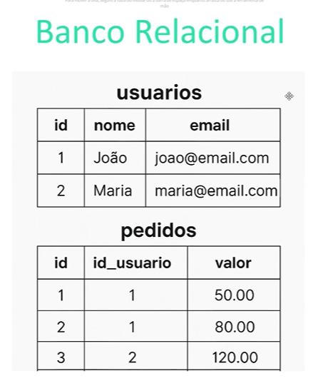

# Introdução ao Mundo dos Bancos de Dados

- todas as aplicações utilizam de banco de dados

- o que é?
  -- coleção organizada e estruturada de informações
  -- registro e campo
  -- registro: uma 'linha' do banco
  -- campo: uma 'coluna' do banco

- sgbd = sistemas gerenciadores de banco de dados
  -- define, por exemplo, como as informações devem ser manipuladas
  -- postgre, mysql, mongodb, ...

- dentro do banco
  -- tabela, registro e campo
  -- manipulação conforme o SGBD (acessar, alterar, criar, excluir, etc...)

_dentro de um SGBD posso ter mais do que um BD_

- BD acessado via software (hardware)
- BD hospedado em um servidor físico (ou virtual)
- Manipulação BD: software faz as requisições
- backups

- Dados: dados brutos (informações brutas)
- Informações: dados organizados e estruturados utilizados para tomada de decisões
- Registro: linha da tabela de um BD
- Campo: coluna da tabela de um BD

## Importância dos BD no Mundo Real


- organização e rapidez na recuperação das informações
- integridade e segurança dos dados
- suporte a aplicações complexas (redes sociais, bancos, transporte, ...)

## Tipos de Bancos de Dados

_Relacionais e Não-Relacionais_

- Relacionais (SQL)
  -- estrutura em tabelas (linhas e colunas => registros e campos)
  -- exemplo: PostreSQL, MySQL, Microsoft SQl Server
  -- linguagem SQL: (_Structured Query Language_) => CRUD

- Não-Relacionais (NoSQL)
  -- estrutura flexível (documentos (JSON), chave-valor (pares), grafos, ...) => não possuem a 'tabela fixa'
  -- exemplos: MongoDB, Firebase, Redis

- diferenças (analogia) => principal: estrutura fixa
  -- relacional: como exemplo, o relacional é como se fosse uma biblioteca organizada, cada livro em seu lugar correto
  -- não-relacional: como exemplo, como se fosse uma caixa com itens variados que tem uma relação entre si, sem necessariamente seguir uma estrutura fixa

## Bancos de Dados Relacionais vs Não Relacionais

- BD Relacional
  -- 
  -- armazena dados em formato de tabela (linhas e colunas) => registros e campos
  -- SQL como linguagem padrão
  -- _tabelas se relacionam entre si_
  -- criar as tabelas de acordo com o contexto que eu estou, não 'preciso' de tudo logo de início
  -- `chave primária`: `id` único do registro (linha => permite buscar por uma linha específica)
  -- posso criar 'regras' dentro das tabelas (não pode ser null, precisa ter uma formatação específica para os 'valores dos campos' - atributos)
  -- banco de dados relacional: relação entre as tabelas
  -- `chave estrangeira`: `id` único de outra tabela, criando o relacionamento entre as tabelas
  -- relacionamentos são essenciais para comunicação entre as tabelas
  -- Vantagens
  --- estruturas organizadas
  --- alta integridade dos dados (devido ao relacionamento temos regras)
  --- ideal para dados estruturados (bancos de dados que exigem que as tabelas 'conversem' entre si)

## Introdução a SQL

- SQL => _structured query language_
  -- linguagem estruturada para consulta de dados
  -- utilizada em BD relacionais para criar, modificar, deletar e consultar dados
  -- principais comandos:

  ```sql
  CREATE TABLE /*cria uma tabela */
  INSERT INTO /*permite inserir dados dentro de uma tabela - criar novos registros*/
  SELECT /*consulta de dados */
  UPDATE /*atualizar um conjunto de dados*/
  DELETE /*remover registros da tabela*/
  ```

-- exemplos básicos:

```sql
/*criar tabela*/
CREATE TABLE usuarios (id SERIAL PRIMARY KEY, nome VARCHAR(100), email VARCHAR(100));
/*inserir dados*/
INSERT INTO usuarios (nome, email) VALUES ('Ana Silva','ana@email.com');
/*selecionar dados (consultar)*/
SELECT * FROM usuarios; /*seleção de todos os campos (o asterisco) da tabela usuarios
select tem muitas variações e possibilidades*/
```

## Introdução ao PostgreSQL

- Banco de dados relacional _open-source_
- seguro, gratuito e robusto
- caracteristicas:
  -- segurança e confiabilidade
  -- compatível com várias linguagens (python, php, javascript)
  -- suporte a tipos de dados avançados (JSON, arrays, dados geográficos)
  -- comunidade ativa e global (comunidades, dúvidas, ...)
  -- projetos pequenos e grandes corporações
- Por que sql com postgresql?
  -- sql é a linguagem padrão, utilizável em outros bancos
  -- ferramenta gratuita e amigável
  -- excelente para iniciantes e projetos avançados
  -- aprendizado aplicável em toda a carreira (fácil adaptação para outros bancos)
  -- comunidade de apoio, boa documentação

## Instalação e configuração PostgreSQL

- https://www.postgresql.org/
- no processo de instalação:
  -- senha - senha para acessar o banco (criar senha robusta)
  -- porta - padrão 5432

- configuração
  -- ferramente nativa pgAdmin (funciona apenas para o postgreSql)
  -- beekeeper, dbeaver (acessa diversos bancos)
  -- teste: abrir o pgadmin, digitar a senha criada e ver se o servidor conectou
  -- teste: criar um novo server
  --- register server => "Local" => "localhost" => password

## Instalação e Configuração BeeKeeper

- https://www.beekeeperstudio.io/get
- versão gratuita, pois tem versões gratuitas
- baixar a versão: _comunity edition_

## Criação do Primeiro Banco e Tabela

- nome do banco de dados é único! não pode existir 2 bancos com o mesmo nome

```sql
/*criando um banco novo através de linha de código*/
CREATE DATABASE agenda;

/*criação de tabelas*/
CREATE TABLE contatos (
  id serial primary key,
  name varchar(100),
  telefone varchar(20)
)
```
